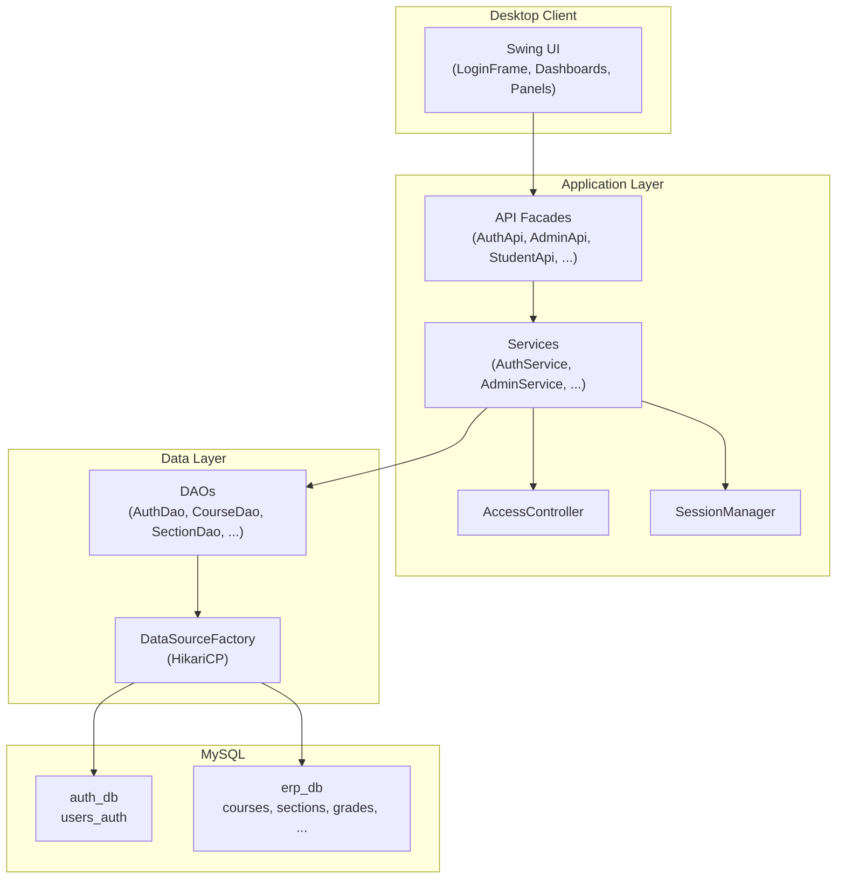

# IIITD ERP

> A desktop University ERP system for course administration, student registration, and instructor gradebook management — built with Java, Swing, and MySQL.

[](https://openjdk.org/)
[](https://maven.apache.org/)
[](https://www.mysql.com/)
[](https://docs.oracle.com/javase/tutorial/uiswing/)
[](#license)

**Contributors:** Eshaan Makkar (2024209) · Prajeet Kumar (2024419)  
**Course:** Advanced Programming, IIIT Delhi · 2025


---

## Overview

**IIITD ERP** is a role-based desktop application that centralizes core academic operations for a university environment. It replaces fragmented, manual workflows — spreadsheets for grades, ad-hoc user management, and disconnected registration tracking — with a single Swing client backed by a structured MySQL data layer.

The system supports three user roles:

| Role | Primary responsibilities |
|------|--------------------------|
| **Admin** | User provisioning, course/section management, maintenance mode |
| **Student** | Browse catalog, register/drop sections, view timetable & grades, export transcript |
| **Instructor** | Manage assigned sections, enter scores, compute weighted final grades |

### Why this project exists

University ERP workflows involve multiple actors (admins, students, instructors) operating on shared academic data with strict access rules. This project demonstrates how to:

- Separate **authentication** from **business data** using two databases
- Enforce **role-based access control** at the service layer
- Build a maintainable **layered Java architecture** without a heavy web framework
- Handle real-world concerns like **maintenance mode**, **capacity limits**, and **grade computation**

> **Note:** This is a **desktop Swing application**, not a web service. The `api` package provides in-process facades for the UI — there is no HTTP/REST server.

---

## Features

### Authentication & Access

- BCrypt password hashing (cost factor 12)
- Role-based routing after login (`admin`, `student`, `instructor`)
- In-memory session management via `SessionManager`
- Centralized access checks through `AccessController`

### Admin

- Create student and instructor accounts (with profile records in `erp_db`)
- List and delete users
- Full CRUD for courses and sections
- Assign instructors to sections
- Toggle **maintenance mode** (blocks student/instructor mutations system-wide)
- Input validation for course codes, departments, and student programs

### Student

- Browse course catalog and register for open sections
- Drop enrolled sections
- View weekly timetable with visual schedule conflict highlighting
- View grades across enrolled sections
- Export transcript to **CSV** (implemented)

### Instructor

- View assigned sections
- Open per-section **gradebook**
- Manage assessment components (default: Quiz, Midsem, Endsem)
- Enter component scores (0–100)
- Compute **weighted final grades** with configurable component weights
- Automatic letter-grade assignment (A/B/C/D/F thresholds)
- View section statistics (averages, min/max)

### System

- Dual-database design (`auth_db` + `erp_db`)
- HikariCP connection pooling
- Maintenance banner synced across dashboards via `EventBus`
- FlatLaf modern Swing theme with custom accent colors

**Demo video:** https://youtu.be/NvEB6syWhLc

---

## Tech Stack

| Layer | Technology |
|-------|------------|
| Language | Java 17 |
| UI | Java Swing, FlatLaf 3.2.5, MigLayout 11.1 |
| Build | Apache Maven 3.6+ |
| Database | MySQL 8.x |
| Connection Pool | HikariCP 5.1.0 |
| Security | jBCrypt 0.4 |
| Logging | SLF4J (via transitive dependencies) |
| Testing | JUnit Jupiter 5.10.1 |
| Planned exports | Apache PDFBox 3.0.1, Apache Commons CSV 1.10.0 *(dependencies present; not all features implemented)* |

---

## Architecture

The application follows a strict layered architecture. The UI never talks to the database directly (with one known exception in `GradebookFrame` — see [Limitations](#limitations)).



### Layer responsibilities

| Layer | Package | Responsibility |
|-------|---------|----------------|
| UI | `edu.univ.erp.ui` | Swing frames, panels, table models, user interaction |
| API | `edu.univ.erp.api` | Thin facades wrapping services; uniform `ApiResponse<T>` |
| Service | `edu.univ.erp.service` | Business rules, validation, orchestration |
| Access | `edu.univ.erp.access` | Role and ownership checks |
| Auth | `edu.univ.erp.auth` | Login/logout, session state |
| DAO | `edu.univ.erp.data.dao` | Parameterized SQL via JDBC |
| Domain | `edu.univ.erp.domain` | Entity models (`Course`, `Section`, `Grade`, …) |

### Database design

Two MySQL databases separate concerns:

**`auth_db`**

| Table | Purpose |
|-------|---------|
| `users_auth` | Credentials, roles, account status |
| `auth_failed_logins` | Failed-login tracking schema *(table exists; not wired in application code)* |

**`erp_db`**

| Table | Purpose |
|-------|---------|
| `students` | Student profiles linked by `user_id` |
| `instructors` | Instructor profiles linked by `user_id` |
| `courses` | Course catalog |
| `sections` | Course offerings (schedule, room, capacity, instructor) |
| `enrollments` | Student–section registrations |
| `grades` | Per-component scores and final letter grades |
| `settings` | Key-value config (e.g. `maintenance`) |

Cross-database references use logical foreign keys on `user_id` — not enforced by MySQL across databases.

### Application startup flow

1. `Main.java` sets FlatLaf look-and-feel and theme colors
2. `LoginFrame` is displayed on the Event Dispatch Thread (EDT)
3. On successful login, `SessionManager` stores the authenticated user
4. User is routed to the appropriate dashboard by role
5. On shutdown, session is cleared and HikariCP pools are closed via `DataSourceFactory.closeAll()`

---

## Installation

### Prerequisites

| Requirement | Version | Verify |
|-------------|---------|--------|
| Java JDK | 17+ | `java -version` |
| Apache Maven | 3.6+ | `mvn --version` |
| MySQL Server | 8.x | MySQL service running |

### 1. Clone and enter the project

```bash
git clone <repository-url>
cd univ-erp
```

### 2. Set up MySQL databases

Run scripts **in order** from the `univ-erp` directory.

**Windows (recommended — helper script):**

```powershell
.\run-sql.ps1 -SqlFile sql/create_databases.sql
.\run-sql.ps1 -SqlFile sql/auth_schema.sql -Database auth_db
.\run-sql.ps1 -SqlFile sql/erp_schema.sql -Database erp_db
.\run-sql.ps1 -SqlFile sql/seed_data.sql
```

**Linux / macOS:**

```bash
mysql -u root -p < sql/create_databases.sql
mysql -u root -p auth_db < sql/auth_schema.sql
mysql -u root -p erp_db  < sql/erp_schema.sql
mysql -u root -p < sql/seed_data.sql
```

> **First-time setup:** If `sql/seed_data.sql` still contains `<BCRYPT-HASH-HERE>` placeholders, generate hashes first:
>
> ```bash
> mvn -q compile exec:java -Dexec.mainClass="edu.univ.erp.util.HashPassword" -Dexec.args="yourpassword"
> ```
>
> Or run `.\generate-all-hashes.ps1` on Windows. See [`RUN_SQL.md`](RUN_SQL.md) for full details.

### 3. Configure database credentials

Edit `src/main/resources/application.properties` (see [Configuration](#configuration)).

### 4. Build

```bash
mvn clean package
```

Skip tests for a faster build:

```bash
mvn -DskipTests package
```

### 5. Run

```bash
mvn compile exec:java
```

Or explicitly:

```bash
mvn compile exec:java -Dexec.mainClass="edu.univ.erp.Main"
```

**IDE:** Open as a Maven project and run `edu.univ.erp.Main`.

---

## Configuration

Database settings are loaded from `src/main/resources/application.properties`:

```properties
# Authentication database
auth.db.url=jdbc:mysql://localhost:3306/auth_db
auth.db.user=root
auth.db.password=YOUR_PASSWORD

# ERP business database
erp.db.url=jdbc:mysql://localhost:3306/erp_db
erp.db.user=root
erp.db.password=YOUR_PASSWORD
```

| Property | Description |
|----------|-------------|
| `auth.db.url` | JDBC URL for the authentication database |
| `auth.db.user` | MySQL username for `auth_db` |
| `auth.db.password` | MySQL password for `auth_db` |
| `erp.db.url` | JDBC URL for the ERP database |
| `erp.db.user` | MySQL username for `erp_db` |
| `erp.db.password` | MySQL password for `erp_db` |

> ⚠️ **Do not commit real credentials to version control.** Use a local, untracked copy of `application.properties` or environment-specific overrides for production.


---

## Usage

### Default seed accounts

After running `sql/seed_data.sql`:

| Username | Password | Role |
|----------|----------|------|
| `admin` | `password` | Admin |
| `inst1` | `inst1pass` | Instructor |
| `stu1` | `stu1pass` | Student |
| `stu2` | `stu2pass` | Student |

### Typical workflows

**Admin**

1. Log in as `admin1`
2. Create courses and sections from the dashboard
3. Assign instructors to sections
4. Toggle maintenance mode when performing system updates

**Student**

1. Log in as `stu1` or `stu2`
2. Open the **Catalog** tab → register for available sections
3. View **My Registrations** → drop if needed
4. Check **Timetable** for schedule conflicts (highlighted visually)
5. View **Grades** and export transcript CSV

**Instructor**

1. Log in as `inst1`
2. Select an assigned section → open **Gradebook**
3. Enter component scores for each student
4. Set component weights → **Compute Final Grades**


## Project Structure

```
univ-erp/
├── pom.xml                          # Maven build configuration
├── README.md                        # This file
├── RUN_SQL.md                       # Detailed database setup guide
├── run-sql.ps1                      # Windows SQL script runner
├── generate-all-hashes.ps1          # BCrypt hash generator helper
├── sql/                             # Database scripts
│   ├── create_databases.sql
│   ├── auth_schema.sql
│   ├── erp_schema.sql
│   ├── seed_data.sql
│   └── constraints/                 # Optional CHECK constraints
├── src/
│   ├── main/
│   │   ├── java/edu/univ/erp/
│   │   │   ├── Main.java            # Application entry point
│   │   │   ├── access/              # RBAC guards
│   │   │   ├── api/                 # UI-facing facades + DTOs
│   │   │   ├── auth/                # Authentication & session
│   │   │   ├── data/                # DAOs & connection factory
│   │   │   ├── domain/              # Entity models
│   │   │   ├── service/             # Business logic
│   │   │   ├── ui/                  # Swing dashboards & panels
│   │   │   └── util/                # Validators, EventBus, helpers
│   │   └── resources/
│   │       └── application.properties
│   └── test/java/edu/univ/erp/      # Unit tests
└── Testing/
    └── HowToRun.md                  # Quick start & troubleshooting
```

---

## Testing

Run the test suite:

```bash
mvn test
```

| Test class | Coverage |
|------------|----------|
| `ValidatorsTest` | Course code, department, and branch validation rules |
| `AdminServiceValidationTest` | Admin service rejects invalid input (mocked DAOs) |
| `InstructorServiceComputeFinalsTest` | Weight-sum validation and letter-grade thresholds |

**Not covered:** integration tests against MySQL, UI tests, authentication flow, maintenance mode, enrollment capacity under concurrency.

For manual testing workflows, see [`Testing/HowToRun.md`](Testing/HowToRun.md).

---

## Security Considerations

| Decision | Rationale |
|----------|-----------|
| BCrypt (cost 12) for passwords | Industry-standard adaptive hashing |
| Separate `auth_db` | Isolates credentials from academic data |
| Prepared statements in all DAOs | Mitigates SQL injection |
| Service-layer RBAC | Centralized, auditable access checks |
| Maintenance mode | Prevents data mutation during admin operations |
| Active-account check at login | Inactive users cannot authenticate |

**Known gaps (appropriate for a course project, not production):**

- Credentials stored in plain `application.properties`
- In-memory single-user session (no multi-client server model)
- `auth_failed_logins` table exists but lockout logic is not implemented
- No HTTPS/TLS (desktop app — N/A)
- Admin accounts cannot be created via UI (by design)

---

## Limitations

| Limitation | Details |
|------------|---------|
| Desktop only | No web client or REST API |
| PDF export | Stub only — PDFBox dependency unused |
| Class list / grade CSV export | Stub methods return errors |
| Schedule conflict enforcement | Visual warning only; registration does not block overlaps |
| Drop deadline | Placeholder flag (`DROP_ALLOWED = true`); not date-based |
| Failed-login lockout | Schema present; logic not implemented |
| Gradebook direct DAO access | `GradebookFrame` reads via `GradeDao` directly (TODO: route through API) |
| Final grade computation | Not wrapped in a DB transaction across all students |
| Admin self-provisioning | UI cannot create admin accounts |
| No GPA / prerequisites | Not implemented |


## Acknowledgements

- **IIIT Delhi** — Advanced Programming course (2025)
- **[FlatLaf](https://www.formdev.com/flatlaf/)** — Modern Swing look and feel
- **[MigLayout](https://www.miglayout.com/)** — Flexible Swing layout manager
- **[HikariCP](https://github.com/brettwooldridge/HikariCP)** — High-performance JDBC connection pooling
- **[jBCrypt](https://github.com/jeremyh/jBCrypt)** — Password hashing

---

<p align="center">
  Built by <strong>Eshaan Makkar</strong> and <strong>Prajeet Kumar</strong> · IIIT Delhi · 2025
</p>
